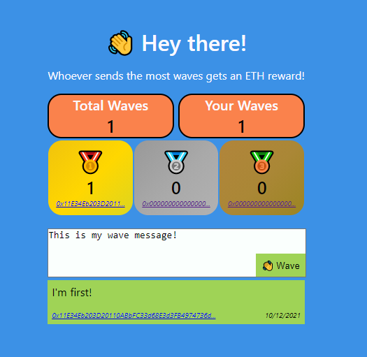

# Wave Portal

This project creates a contract that allows users to wave and post messages.
The objective is to have the most waves. Whoever reaches #1 gets an ETH payout!
Deployed on the Rinkeby network so no real ETH is used.

To test contract with run script:
`npx hardhat run scripts/run.js`

To deploy contract on Rinkeby:
`npx hardhat run --network rinkeby scripts/deploy.js`

Project created with buildspace.

What the app looks like with the frontend (https://github.com/wleung85/wave-portal-front):
